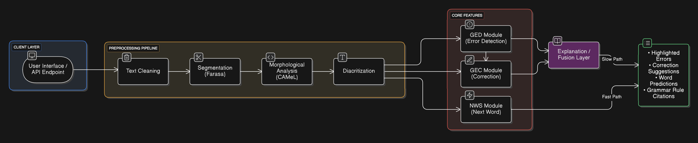
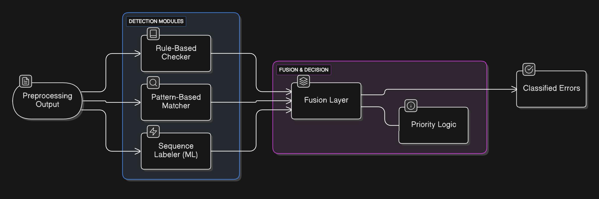
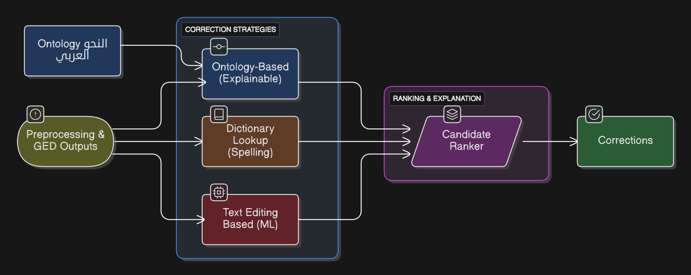
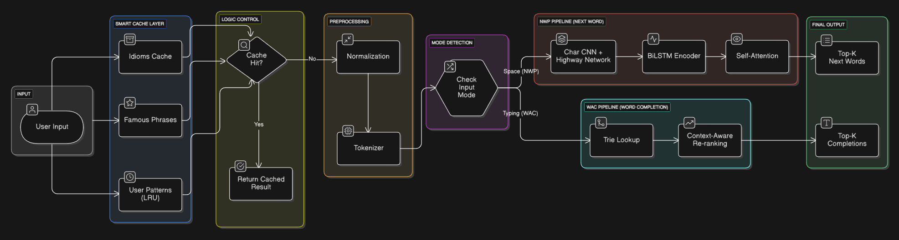

<!-- markdownlint-disable MD033 -->
<!-- markdownlint-disable MD034 -->
<!-- markdownlint-disable MD041 -->

  

  Arabic writing assistance for Modern Standard Arabic, 
  built around explainable correction, linguistic evidence, and fast suggestions.

  
  

https://github.com/user-attachments/assets/f5f6ddc8-5b6f-40d5-a7a4-1a9052c67ab8

---

##  What Is Baligh?

**Baligh (بليغ)** is a graduation-project Arabic NLP system for helping people write correct, fluent Modern Standard Arabic. It combines grammatical error detection, grammatical error correction, and next-word suggestion in one interactive writing pipeline.

The project is intentionally not a black-box rewriting tool. Every surfaced correction is designed to carry evidence: a rule, a linguistic category, a source module, or a confidence trail that explains why the suggestion exists.

---

##  The Pipeline

  

Baligh separates lightweight interaction from deeper analysis. The fast path handles word completion and next-word suggestion while the user is typing. The slower path runs grammatical detection, correction, ranking, and explanation once enough context is available.

---

##  Core Features

### Grammatical Error Detection

The GED layer finds spans that may contain orthographic, morphological, syntactic, punctuation, merge, or split errors. It fuses rule-based detectors, lexicon and pattern matchers, and learned sequence-labeling signals into a single ranked error list.

  

### Grammatical Error Correction

The GEC layer proposes edits using multiple correction sources: ontology-backed grammatical constraints, dictionary-based spelling and lexical candidates, and edit-tagger models. A ranker then chooses the strongest candidates using confidence, provenance, and edit quality.

  

### Next Word Suggestion

The NWS layer supports both next-word prediction and word auto-completion. It uses cached phrases, trie lookup, language-model scoring, and context-aware re-ranking so suggestions stay responsive during live typing.

  

### Explanation First

Baligh tracks provenance across the pipeline. A correction can be rule-derived, rule-supported, or statistical, and the UI/API contract keeps that distinction visible instead of presenting every suggestion with the same certainty.

---

##  Project Documents

Research notes, reports, and graduation deliverables are maintained separately in [El-Maktab/baligh-documents](https://github.com/El-Maktab/baligh-documents).
