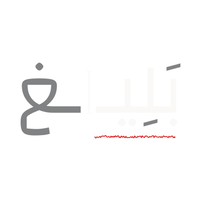

<!-- markdownlint-disable MD033 -->
<!-- markdownlint-disable MD041 -->

<p align="center">
  
</p>

<p align="center">
  Arabic writing assistance for Modern Standard Arabic,<br>
  built for explainable corrections and fast, reliable suggestions.
</p>

<p align="center">
  
  
</p>

## How to run

1. You need an environment with:
   - UV
   - Make
   - MongoDB
   - PNPM

2. Run the setup make command

```sh
make setup
```

3. Create 2 env files for frontend and backend, based on the provided `.env.example` files in each directory.

4. Run the server

```sh
make run-api
```

5. Run the frontend

```sh
cd clients/web/
pnpm run dev
```

## Project Documents

Research notes, documents, and project deliverables are maintained in a separate repository:
[El-Maktab/baligh-documents](https://github.com/El-Maktab/baligh-documents)
