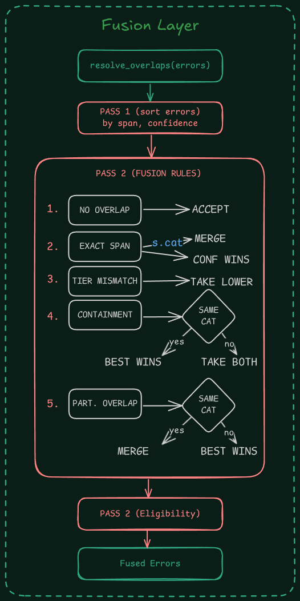

# GED Fusion Layer

**Author:** Amir Anwar

---

## Diagram



---

## Algorithm

### Pass 1 : Sort

All incoming spans are sorted by `(span.start ASC, span.end DESC, confidence DESC)`.

### Pass 2 : Conflict-Resolution

A single left-to-right sweep over the sorted list. Each candidate is compared against the last accepted span.

```txt
for each candidate:
    if no overlap with last accepted:
        accept
    else:
        apply the decision table below
```

#### Decision Table

| Overlap type                      | Previous tier             | Current tier              | Action                                  |
| --------------------------------- | ------------------------- | ------------------------- | --------------------------------------- |
| No overlap                        | any                       | any                       | Accept                                  |
| Exact same span, same category    | any                       | any                       | Merge sources -> higher confidence wins |
| Exact same span, diff category    | any                       | any                       | Higher confidence wins                  |
| Overlap                           | tier_1 or tier_2          | tier_3                    | tier_3 loses                            |
| Overlap                           | tier_3                    | tier_1 or tier_2          | Replace tier_3 with incoming            |
| Containment (current in previous) | diff categories           | diff categories           | Keep both                               |
| Containment (current in previous) | same category             | any                       | Higher confidence wins                  |
| Partial overlap                   | same tier + same category | same tier + same category | Merge into widest span                  |
| Partial overlap                   | otherwise                 | otherwise                 | Higher confidence wins                  |

### Pass 3 : Eligibility

Walk the accepted list and enforce explanation rules:
